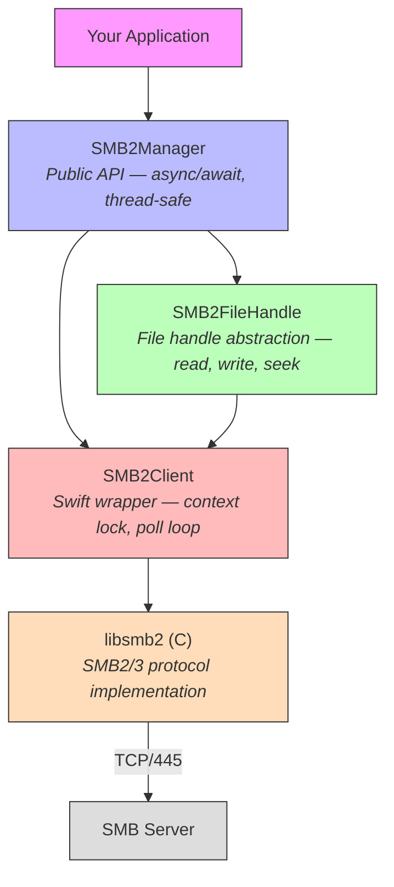
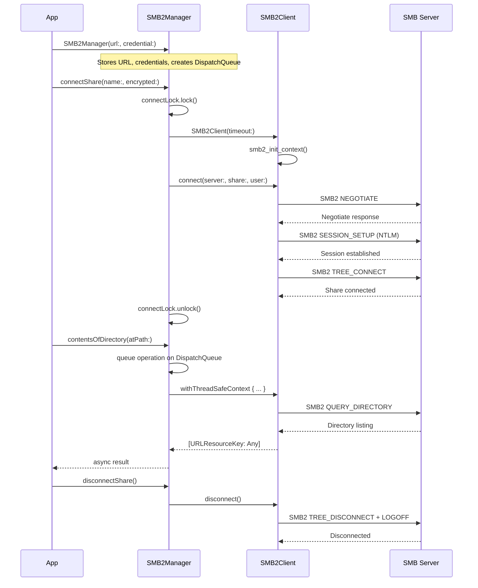
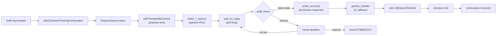
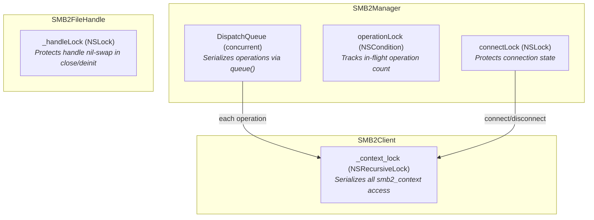

# AMSMB2 Architecture

This document describes the internal architecture of AMSMB2, a Swift library that wraps [libsmb2](https://github.com/sahlberg/libsmb2) to provide SMB2/3 file operations for Apple platforms and Linux.

## Layer Stack

AMSMB2 is organized in four layers. Each layer depends only on the layer below it.

| Layer | Class | Responsibility |
|-------|-------|----------------|
| **Public API** | `SMB2Manager` | Connection lifecycle, all file/directory operations, NSSecureCoding/Codable, Obj-C compatibility |
| **File Abstraction** | `SMB2FileHandle` | Open/close files, read/write/seek, IOCTL (fsctl), Change Notify |
| **Context Wrapper** | `SMB2Client` | Wraps `smb2_context`, provides thread-safe access via `withThreadSafeContext()`, manages poll-based async operations |
| **C Library** | libsmb2 | SMB2/3 protocol encoding/decoding, network I/O, NTLM authentication |

## Connection Lifecycle

## Async Operation Flow

Every SMB2 operation follows the same pattern: Swift async/await is bridged to libsmb2's C callback-based async API through a poll loop.

Key details:
- **CBData** is a class (heap-allocated) passed to C callbacks via `Unmanaged<CBData>.passUnretained`. The C callback recovers it via `Unmanaged<CBData>.fromOpaque`.
- **poll loop** runs on the DispatchQueue thread, not the Swift concurrency thread. The Swift task suspends via `withCheckedThrowingContinuation` until the completion handler fires.
- **Timeout** is configurable via `SMB2Manager.timeout` (default: 60 seconds).

## Thread Safety Model

| Lock | Type | Protects | Held During |
|------|------|----------|-------------|
| `connectLock` | `NSLock` | `SMB2Manager.client` reference, connection state | `connectShare()`, `disconnectShare()`, `smbClient` getter |
| `operationLock` | `NSCondition` | `operationCount` — tracks in-flight operations | Increment/decrement around each queued operation |
| `_context_lock` | `NSRecursiveLock` | All access to the `smb2_context` C pointer | Entire duration of each SMB2 operation (including poll loop) |
| `_handleLock` | `NSLock` | `SMB2FileHandle.handle` pointer | `close()` and `deinit` only (nil-swap pattern) |

**Concurrency guarantees:**
- `SMB2Manager` is `@unchecked Sendable` — safe to share across actors and tasks
- Operations dispatched via `queue()` run on a concurrent `DispatchQueue`, but each operation acquires `_context_lock` on the `SMB2Client`, effectively serializing access to the underlying C context
- Multiple `SMB2Manager` instances (separate connections) can operate fully in parallel

## Source File Map

| File | Layer | Responsibility |
|------|-------|----------------|
| `AMSMB2.swift` | Public API | `SMB2Manager` class — all public file/directory/connection operations |
| `Context.swift` | Context Wrapper | `SMB2Client` class — smb2_context lifecycle, async operation bridge, poll loop |
| `FileHandle.swift` | File Abstraction | `SMB2FileHandle` class — open/close/read/write/seek/ioctl/changeNotify |
| `Directory.swift` | File Abstraction | Directory enumeration handle |
| `Stream.swift` | Public API | `AsyncInputStream` — adapts `AsyncSequence` to `InputStream` for streaming writes |
| `Fsctl.swift` | File Abstraction | IOCTL command definitions, server-side copy chunks, reparse point (symlink) data structures |
| `MSRPC.swift` | Internal | MS-RPC protocol for share enumeration (`NetrShareEnum`) |
| `FileMonitoring.swift` | Public API | `SMB2FileChangeType`, `SMB2FileChangeAction`, `SMB2FileChangeInfo` — Change Notify types |
| `Extensions.swift` | Internal | `URLResourceKey` convenience accessors, `POSIXError` helpers, `Optional.unwrap()` |
| `Parsers.swift` | Internal | Response parsing — decodes C structs into Swift types |
| `ObjCCompat.swift` | Public API | Objective-C compatibility — completion handler variants of all `SMB2Manager` methods |
