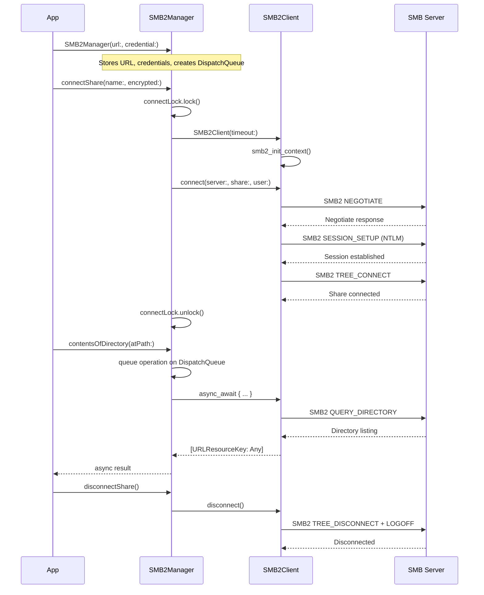
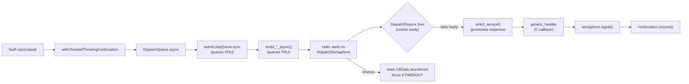
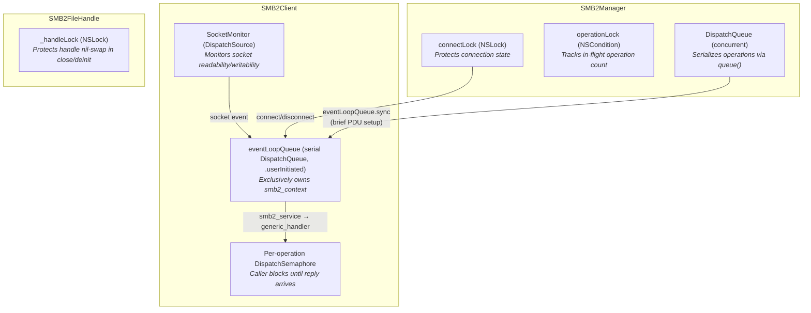
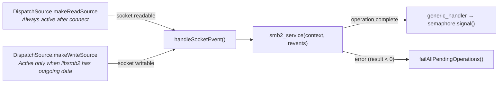
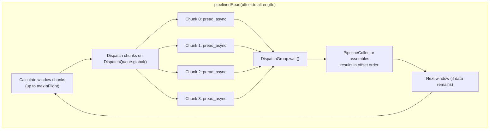

# AMSMB2 Architecture

This document describes the internal architecture of AMSMB2, a Swift library that wraps [libsmb2](https://github.com/sahlberg/libsmb2) to provide SMB2/3 file operations for Apple platforms and Linux.

## Layer Stack

AMSMB2 is organized in four layers. Each layer depends only on the layer below it.

| Layer | Class | Responsibility |
|-------|-------|----------------|
| **Public API** | `SMB2Manager` | Connection lifecycle, all file/directory operations, NSSecureCoding/Codable, Obj-C compatibility |
| **File Abstraction** | `SMB2FileHandle` | Open/close files, read/write/seek, IOCTL (fsctl), Change Notify |
| **Context Wrapper** | `SMB2Client` | Wraps `smb2_context`, provides thread-safe access via a serial event loop queue, manages `DispatchSource`-based async operations |
| **C Library** | libsmb2 | SMB2/3 protocol encoding/decoding, network I/O, NTLM authentication |

## Connection Lifecycle

## Async Operation Flow

Every SMB2 operation follows the same pattern: Swift async/await is bridged to libsmb2's C callback-based async API through a serial event loop queue and `DispatchSource`-based socket monitoring.

Key details:
- **CBData** is a class (heap-allocated) passed to C callbacks via `Unmanaged<CBData>.passRetained`. The C callback recovers it via `Unmanaged<CBData>.fromOpaque(..).takeRetainedValue()`, balancing the retain count.
- **DispatchSource** monitors the socket file descriptor for readability and writability. When the socket has I/O events, `handleSocketEvent()` calls `smb2_service()` on the event loop queue, which invokes `generic_handler` for any completed operations.
- **Multiple operations** can be in-flight simultaneously. Each operation gets its own `CBData` with its own `DispatchSemaphore`. The event loop queue services all pending requests concurrently.
- **Timeout** is configurable via `SMB2Manager.timeout` (default: 60 seconds). On timeout, `CBData.isAbandoned` is set so the eventual callback skips signaling the already-abandoned semaphore.
- **Connection** uses a temporary poll loop (`pollUntilComplete`) because the `DispatchSource` cannot be created until the socket fd exists. After connect completes, `startSocketMonitoring()` switches to the event-driven model.

## Thread Safety Model

| Mechanism | Type | Protects | Held During |
|-----------|------|----------|-------------|
| `connectLock` | `NSLock` | `SMB2Manager.client` reference, connection state | `connectShare()`, `disconnectShare()`, `smbClient` getter |
| `operationLock` | `NSCondition` | `operationCount` — tracks in-flight operations | Increment/decrement around each queued operation |
| `eventLoopQueue` | Serial `DispatchQueue` (`.userInitiated` QoS) | All access to the `smb2_context` C pointer | PDU setup (brief `sync`), socket event handling, shutdown |
| `SocketMonitor` | `DispatchSource` (read + write) | Socket I/O event delivery | Fires on the event loop queue when the socket is readable/writable |
| `CBData.semaphore` | `DispatchSemaphore` | Per-operation completion signaling | Caller waits after PDU setup; signaled by `generic_handler` |
| `_handleLock` | `NSLock` | `SMB2FileHandle.handle` pointer | `close()` and `deinit` only (nil-swap pattern) |

**Concurrency guarantees:**
- `SMB2Manager` is `@unchecked Sendable` — safe to share across actors and tasks
- The serial `eventLoopQueue` exclusively owns the `smb2_context`. All libsmb2 calls execute on this queue. Operations use `eventLoopQueue.sync` only for brief PDU setup, then wait on their own `DispatchSemaphore` — this allows multiple operations to be in-flight simultaneously
- `DispatchSource` monitors socket readability/writability. When I/O events arrive, `handleSocketEvent()` runs on the event loop queue and calls `smb2_service()`, which invokes `generic_handler` for completed operations
- `CBData` uses `Unmanaged.passRetained()`/`takeRetainedValue()` for safe C callback bridging — the retain count keeps `CBData` alive until the callback fires, even if the caller has timed out
- Property accessors use `syncOnEventLoop()` with a `DispatchSpecificKey` deadlock guard to safely read context state from any thread
- `deinit` dispatches `shutdown()` onto the event loop queue, and `fireAndForget()` captures `self` strongly for safe cleanup of file handles
- Multiple `SMB2Manager` instances (separate connections) can operate fully in parallel

## Socket Monitoring

After a connection is established, `SMB2Client` creates a `SocketMonitor` — a private helper that wraps `DispatchSource` for efficient, non-blocking socket I/O.

- The **read source** is always active after connect. It fires whenever the socket has incoming data.
- The **write source** is lazily created and toggled via `activateWriteSourceIfNeeded()` — it is resumed when `smb2_which_events()` indicates `POLLOUT` (outgoing data pending), and suspended otherwise.
- On connection error, `handleSocketEvent()` destroys the context and calls `failAllPendingOperations()`, which sets `isAbandoned` on all pending `CBData` and signals their semaphores with `ECONNRESET`.

## Buffer Pool

`BufferPool` is a reusable fixed-capacity buffer pool that eliminates per-read allocation overhead. It is owned by `SMB2Client` and shared across all read operations on that client.

- **`checkout(minimumSize:)`** returns a buffer of at least the requested size — preferring a pooled buffer that is already large enough, resizing one if possible, or allocating fresh.
- **`checkin(_:)`** returns a buffer to the pool. Buffers beyond `maxPoolSize` (default: 8) are discarded.
- Thread-safe via an internal `NSLock`.

Read operations (`read()`, `pread()`, `pipelinedRead()`) check out a buffer, perform the I/O into it, copy the result into a `Data` value, and check the buffer back in. This avoids per-operation zero-fill and reduces allocation pressure during large file transfers.

## Pipelined I/O

`SMB2FileHandle` provides `pipelinedRead()` and `pipelinedWrite()` methods that dispatch multiple concurrent chunk operations via `DispatchGroup` to saturate the network link.

- **`maxInFlight`** (default: 4) controls how many concurrent requests are in a single window.
- Each chunk dispatches to `DispatchQueue.global()`, where it calls `client.async_await` — the PDU is set up on the event loop queue, then the global queue thread waits on its semaphore.
- `PipelineCollector` is a thread-safe indexed container that collects results from concurrent operations and returns them in order.
- The file handle pointer is captured as a raw integer (`UInt(bitPattern:)`) to safely cross `Sendable` boundaries.

## Source File Map

| File | Layer | Responsibility |
|------|-------|----------------|
| `AMSMB2.swift` | Public API | `SMB2Manager` class — all public file/directory/connection operations |
| `Context.swift` | Context Wrapper | `SMB2Client` class — smb2_context lifecycle, event loop queue, `SocketMonitor`, `BufferPool`, async operation bridge |
| `FileHandle.swift` | File Abstraction | `SMB2FileHandle` class — open/close/read/write/seek/ioctl/changeNotify, pipelined I/O |
| `Directory.swift` | File Abstraction | Directory enumeration handle |
| `Stream.swift` | Public API | `AsyncInputStream` — adapts `AsyncSequence` to `InputStream` for streaming writes, with high-water/low-water mark backpressure |
| `Fsctl.swift` | File Abstraction | IOCTL command definitions, server-side copy chunks, reparse point (symlink) data structures |
| `MSRPC.swift` | Internal | MS-RPC protocol for share enumeration (`NetrShareEnum`) |
| `FileMonitoring.swift` | Public API | `SMB2FileChangeType`, `SMB2FileChangeAction`, `SMB2FileChangeInfo` — Change Notify types |
| `Extensions.swift` | Internal | `URLResourceKey` convenience accessors, `POSIXError` helpers, `Optional.unwrap()` |
| `Parsers.swift` | Internal | Response parsing — decodes C structs into Swift types |
| `ObjCCompat.swift` | Public API | Objective-C compatibility — completion handler variants of all `SMB2Manager` methods |
