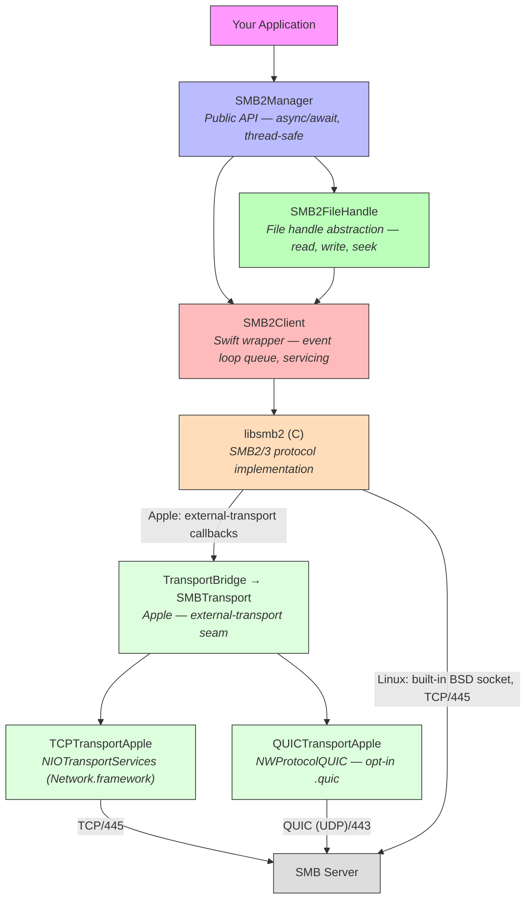
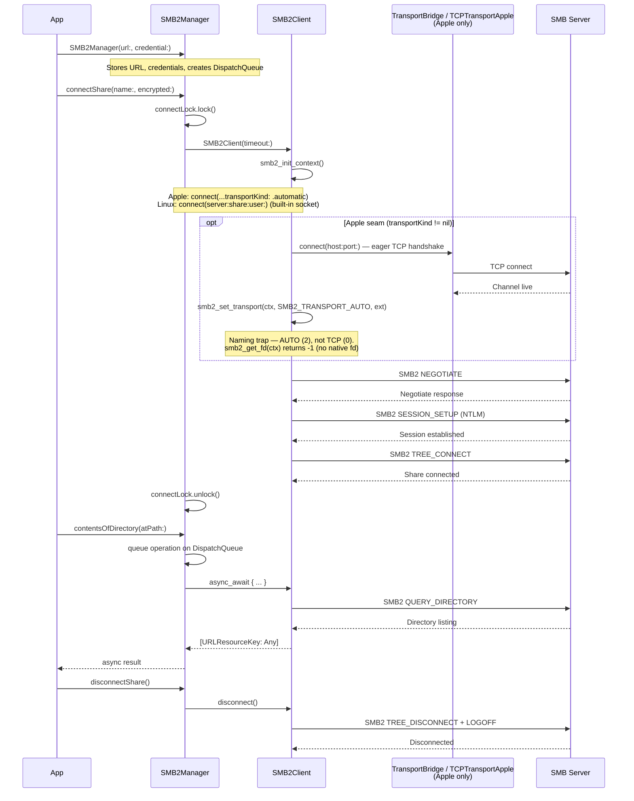
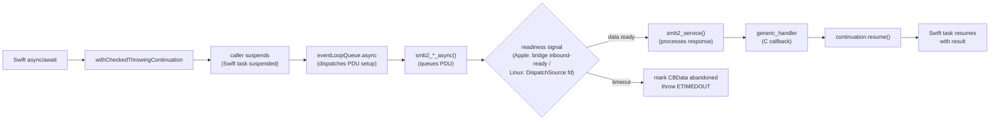
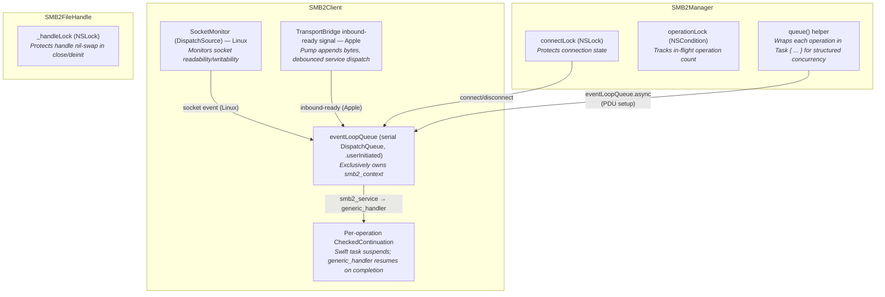
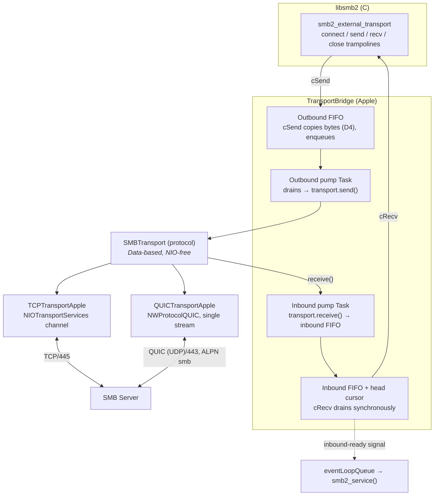
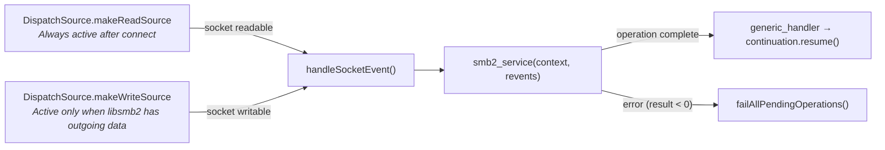
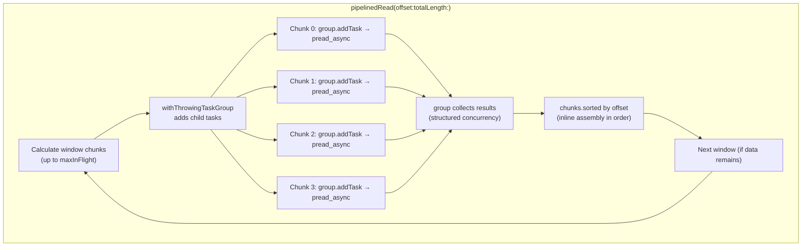

# AMSMB2 Architecture

This document describes the internal architecture of AMSMB2, a Swift library that wraps the [simplekube-ro/libsmb2](https://github.com/simplekube-ro/libsmb2) fork (a fork of [sahlberg/libsmb2](https://github.com/sahlberg/libsmb2) that adds a pluggable external-transport C API) to provide SMB2/3 file operations for Apple platforms and Linux.

The external-transport API lets AMSMB2 carry the SMB2 byte stream over a Swift-owned transport instead of libsmb2's built-in BSD socket. On Apple platforms the library uses this seam by default to run SMB2 over `NIOTransportServices` (SwiftNIO on Network.framework); on Linux it keeps libsmb2's built-in socket. See [Transport Layer](#transport-layer) for the full picture.

## Layer Stack

AMSMB2 is organized in four layers. Each layer depends only on the layer below it. Below `SMB2Client`, the path from libsmb2 to the network differs by platform: Apple routes through the transport seam; Linux uses libsmb2's built-in socket.

```mermaid
graph TB
    App["Your Application"]
    Manager["SMB2Manager<br/><i>Public API — async/await, thread-safe</i>"]
    FileHandle["SMB2FileHandle<br/><i>File handle abstraction — read, write, seek</i>"]
    Client["SMB2Client<br/><i>Swift wrapper — event loop queue, servicing</i>"]
    LibSMB2["libsmb2 (C)<br/><i>SMB2/3 protocol implementation</i>"]
    Bridge["TransportBridge → SMBTransport<br/><i>Apple — external-transport seam</i>"]
    TCP["TCPTransportApple<br/><i>NIOTransportServices (Network.framework)</i>"]
    QUIC["QUICTransportApple<br/><i>NWProtocolQUIC — opt-in .quic</i>"]
    Server["SMB Server"]

    App --> Manager
    Manager --> FileHandle
    Manager --> Client
    FileHandle --> Client
    Client --> LibSMB2
    LibSMB2 -->|"Apple: external-transport callbacks"| Bridge
    Bridge --> TCP
    Bridge --> QUIC
    TCP -->|"TCP/445"| Server
    QUIC -->|"QUIC (UDP)/443"| Server
    LibSMB2 -->|"Linux: built-in BSD socket, TCP/445"| Server

    style App fill:#f9f,stroke:#333
    style Manager fill:#bbf,stroke:#333
    style FileHandle fill:#bfb,stroke:#333
    style Client fill:#fbb,stroke:#333
    style LibSMB2 fill:#fdb,stroke:#333
    style Bridge fill:#dfd,stroke:#333
    style TCP fill:#dfd,stroke:#333
    style QUIC fill:#dfd,stroke:#333
    style Server fill:#ddd,stroke:#333
```

| Layer | Class | Responsibility |
|-------|-------|----------------|
| **Public API** | `SMB2Manager` | Connection lifecycle, all file/directory operations, NSSecureCoding/Codable (passwords excluded from serialization), Obj-C compatibility |
| **File Abstraction** | `SMB2FileHandle` | Open/close files, read/write/seek, IOCTL (fsctl), Change Notify |
| **Context Wrapper** | `SMB2Client` | Wraps `smb2_context`, provides thread-safe access via a serial event loop queue, drives servicing (Apple: seam signal loop; Linux: `DispatchSource`) |
| **Transport (Apple)** | `TransportBridge`, `SMBTransport`, `TCPTransportApple`, `QUICTransportApple` | Carries the SMB2 byte stream over a Swift-owned Network.framework connection (TCP via NIOTS by default, or QUIC opt-in) through libsmb2's external-transport callbacks |
| **C Library** | libsmb2 | SMB2/3 protocol encoding/decoding, network I/O (Linux), NTLM authentication |

## Connection Lifecycle

```mermaid
sequenceDiagram
    participant App
    participant Manager as SMB2Manager
    participant Client as SMB2Client
    participant Transport as TransportBridge / TCPTransportApple<br/>(Apple only)
    participant Server as SMB Server

    App->>Manager: SMB2Manager(url:, credential:)
    Note over Manager: Stores URL, credentials, creates DispatchQueue

    App->>Manager: connectShare(name:, encrypted:)
    Manager->>Manager: connectLock.lock()
    Manager->>Client: SMB2Client(timeout:)
    Client->>Client: smb2_init_context()
    Note over Manager,Client: Apple: connect(...transportKind: .automatic)<br/>Linux: connect(server:share:user:) (built-in socket)
    opt Apple seam (transportKind != nil)
        Client->>Transport: connect(host:port:) — eager TCP handshake
        Transport->>Server: TCP connect
        Server-->>Transport: Channel live
        Client->>Client: smb2_set_transport(ctx, SMB2_TRANSPORT_AUTO, ext)
        Note over Client: Naming trap — AUTO (2), not TCP (0).<br/>smb2_get_fd(ctx) returns -1 (no native fd)
    end
    Client->>Server: SMB2 NEGOTIATE
    Server-->>Client: Negotiate response
    Client->>Server: SMB2 SESSION_SETUP (NTLM)
    Server-->>Client: Session established
    Client->>Server: SMB2 TREE_CONNECT
    Server-->>Client: Share connected
    Manager->>Manager: connectLock.unlock()

    App->>Manager: contentsOfDirectory(atPath:)
    Manager->>Manager: queue operation on DispatchQueue
    Manager->>Client: async_await { ... }
    Client->>Server: SMB2 QUERY_DIRECTORY
    Server-->>Client: Directory listing
    Client-->>Manager: [URLResourceKey: Any]
    Manager-->>App: async result

    App->>Manager: disconnectShare()
    Manager->>Client: disconnect()
    Client->>Server: SMB2 TREE_DISCONNECT + LOGOFF
    Server-->>Client: Disconnected
```

### Client lifetime, cancellation, and pooling (consumer guidance)

These are consumer-facing contracts for code that holds `SMB2Manager`/`SMB2Client` across
operations (e.g. a connection pool that leases clients to concurrent readers):

- **Recycling or abandoning a client while reads are in flight is use-after-free-safe.**
  Cancelling the Swift `Task` of an in-flight operation (e.g. when a streaming/proxy session is
  torn down mid-read) does **not** unschedule the underlying libsmb2 PDU — the C library still
  owns the callback data and will invoke the callback exactly once (on the eventual reply, or
  during context teardown). The library keeps that callback data (and the read buffer) alive for
  libsmb2 until then, so a late callback always lands on valid memory. (Fixed in 5.99.6; see the
  archived `fix-cbdata-cancel-race-uaf` change.)

- **`disconnect()` does not destroy the context — it is reclaimed at `deinit`.** `disconnect()`
  closes the transport and fails pending operations, but the `smb2_context` and the callback data
  of any still-pending operation are not freed until the client is released and `deinit` runs
  `smb2_destroy_context`. A client that is `disconnect()`-ed but **retained** therefore pins those
  resources until it is dropped.

- **For long-lived pools, prefer constructing a fresh client over `disconnect()` + reuse.**
  Releasing the client (letting it `deinit`) performs the full teardown and drains pending PDUs.
  Reusing a `disconnect()`-ed instance keeps the leak window above open and risks interaction with
  PDUs left queued in libsmb2. (Interim guidance — to be made a hard rule if
  [#49](https://github.com/simplekube-ro/AMSMB2/issues/49) lands the `disconnect()`-destroys-context
  change, after which a `disconnect()`-ed instance cannot be reused at all.)

## Async Operation Flow

Every SMB2 operation follows the same pattern: Swift async/await is bridged to libsmb2's C callback-based async API through a serial event loop queue. What signals the queue to call `smb2_service()` is platform-dependent — on Apple, an inbound-ready signal from the transport bridge; on Linux, `DispatchSource` socket monitoring — but everything from `smb2_service()` onward is identical.

```mermaid
flowchart LR
    A["Swift async/await"] --> B["withCheckedThrowingContinuation"]
    B --> C["caller suspends<br/>(Swift task suspended)"]
    C --> D["eventLoopQueue.async<br/>(dispatches PDU setup)"]
    D --> E["smb2_*_async()<br/>(queues PDU)"]
    E --> F{"readiness signal<br/>(Apple: bridge inbound-ready /<br/>Linux: DispatchSource fd)"}
    F -->|"data ready"| G["smb2_service()<br/>(processes response)"]
    G --> H["generic_handler<br/>(C callback)"]
    H --> I["continuation.resume()"]
    I --> J["Swift task resumes<br/>with result"]
    F -->|"timeout"| K["mark CBData abandoned<br/>throw ETIMEDOUT"]
```

Key details:
- **CBData** is a class (heap-allocated) passed to C callbacks via `Unmanaged<CBData>.passRetained`. The C callback recovers it via `Unmanaged<CBData>.fromOpaque(..).takeRetainedValue()`, balancing the retain count.
- **Readiness signalling** differs by platform but converges on `smb2_service()`:
  - **Apple (seam):** the bridge's inbound pump appends received bytes and fires an inbound-ready signal; a (debounced) `eventLoopQueue.async` then calls `serviceContextForSeam()` → `smb2_service()`. There is no socket fd (`smb2_get_fd == -1`). See [Transport Layer](#transport-layer).
  - **Linux (legacy):** `DispatchSource` monitors the socket file descriptor; on I/O events `handleSocketEvent()` calls `smb2_service()` on the event loop queue. See [Socket Monitoring (Linux)](#socket-monitoring-linux).
- **Multiple operations** can be in-flight simultaneously. Each operation gets its own `CBData` with its own `CheckedContinuation`. The event loop queue services all pending requests concurrently.
- **Timeout** is configurable via `SMB2Manager.timeout` (default: 60 seconds). On timeout, `CBData.isAbandoned` is set so the eventual callback skips resuming the already-abandoned continuation. Under the seam, libsmb2's own per-PDU deadlines are additionally driven by a timer (`smb2_get_timeout` / `smb2_service_timeout`).
- **Connection** on Apple completes through the seam servicing loop (bridge-driven, no fd poll). On Linux it uses a temporary poll loop (`pollUntilComplete`) because the `DispatchSource` cannot be created until the socket fd exists; after connect, `startSocketMonitoring()` switches to the event-driven model.

## Thread Safety Model

```mermaid
graph TB
    subgraph SMB2Manager
        CL["connectLock (NSLock)<br/><i>Protects connection state</i>"]
        OL["operationLock (NSCondition)<br/><i>Tracks in-flight operation count</i>"]
        DQ["queue() helper<br/><i>Wraps each operation in Task { ... } for structured concurrency</i>"]
    end

    subgraph SMB2Client
        ELQ["eventLoopQueue (serial DispatchQueue, .userInitiated)<br/><i>Exclusively owns smb2_context</i>"]
        SM["SocketMonitor (DispatchSource) — Linux<br/><i>Monitors socket readability/writability</i>"]
        BR["TransportBridge inbound-ready signal — Apple<br/><i>Pump appends bytes, debounced service dispatch</i>"]
        CONT["Per-operation CheckedContinuation<br/><i>Swift task suspends; generic_handler resumes on completion</i>"]
    end

    subgraph SMB2FileHandle
        HL["_handleLock (NSLock)<br/><i>Protects handle nil-swap in close/deinit</i>"]
    end

    DQ -->|"eventLoopQueue.async<br/>(PDU setup)"| ELQ
    SM -->|"socket event (Linux)"| ELQ
    BR -->|"inbound-ready (Apple)"| ELQ
    ELQ -->|"smb2_service → generic_handler"| CONT
    CL -->|"connect/disconnect"| ELQ
```

| Mechanism | Type | Protects | Held During |
|-----------|------|----------|-------------|
| `connectLock` | `NSLock` | `SMB2Manager.client` reference, connection state | `connectShare()`, `disconnectShare()`, `smbClient` getter |
| `operationLock` | `NSCondition` | `operationCount` — tracks in-flight operations | Increment/decrement around each queued operation |
| `eventLoopQueue` | Serial `DispatchQueue` (`.userInitiated` QoS) | All access to the `smb2_context` C pointer | PDU setup (async dispatch), readiness/timeout servicing, shutdown |
| `SocketMonitor` (Linux) | `DispatchSource` (read + write) | Socket I/O event delivery | Fires on the event loop queue when the socket is readable/writable |
| `TransportBridge.lock` (Apple) | `NSLock` | Inbound/outbound FIFOs, pump tasks, EOF/error flags | Each `cSend`/`cRecv` callback and pump-task mutation (never holds `await`) |
| `CBData.continuation` | `CheckedContinuation<Void, any Error>` | Per-operation completion bridging | Swift task suspends; `generic_handler` resumes on completion |
| `_handleLock` | `NSLock` | `SMB2FileHandle.handle` pointer | `close()` and `deinit` only (nil-swap pattern) |

**Concurrency guarantees:**
- `SMB2Manager` is `@unchecked Sendable` — safe to share across actors and tasks
- The serial `eventLoopQueue` exclusively owns the `smb2_context`. All libsmb2 calls execute on this queue (on both platforms — only what *signals* the queue differs). Operations use `eventLoopQueue.async` for PDU setup, then the Swift task suspends via `CheckedContinuation` — this allows multiple operations to be in-flight simultaneously
- **Apple:** the `TransportBridge` inbound pump appends received bytes and fires an inbound-ready signal that dispatches `serviceContextForSeam()` → `smb2_service()` on the event loop queue (no socket fd). **Linux:** `DispatchSource` monitors socket readability/writability and `handleSocketEvent()` calls `smb2_service()`. Either way, `smb2_service()` invokes `generic_handler` for completed operations
- `CBData` uses `Unmanaged.passRetained()`/`takeRetainedValue()` for safe C callback bridging — the retain count keeps `CBData` alive until the callback fires, even if the caller has timed out
- Property accessors use `syncOnEventLoop()` with a `DispatchSpecificKey` deadlock guard to safely read context state from any thread
- `deinit` dispatches `shutdown()` onto the event loop queue, and `fireAndForget()` captures `self` strongly for safe cleanup of file handles
- Multiple `SMB2Manager` instances (separate connections) can operate fully in parallel

## Transport Layer

> **Platform:** Apple only (`#if canImport(Network)`). This is the **default** transport for Apple platforms — `SMB2Manager.connectShare(...)` routes through it automatically. Linux keeps libsmb2's built-in socket (see [Socket Monitoring (Linux)](#socket-monitoring-linux)).

On Apple platforms, AMSMB2 does not let libsmb2 own a BSD socket. Instead it installs a Swift-owned transport through libsmb2's **external-transport** C API, so the SMB2 byte stream rides over a Swift transport. This is the *transport seam*: a narrow, NIO-free, libsmb2-free boundary that decouples the SMB2 client from any specific wire implementation. Two conformers exist: `TCPTransportApple` (`NIOTransportServices`, the default) and `QUICTransportApple` (Network.framework `NWProtocolQUIC`, opt-in via `SMB2Manager.transportKind = .quic`).

```mermaid
flowchart TB
    subgraph libsmb2["libsmb2 (C)"]
        EXT["smb2_external_transport<br/>connect / send / recv / close trampolines"]
    end
    subgraph bridge["TransportBridge (Apple)"]
        OUT["Outbound FIFO<br/>cSend copies bytes (D4), enqueues"]
        OPUMP["Outbound pump Task<br/>drains → transport.send()"]
        IPUMP["Inbound pump Task<br/>transport.receive() → inbound FIFO"]
        IN["Inbound FIFO + head cursor<br/>cRecv drains synchronously"]
    end
    Proto["SMBTransport (protocol)<br/><i>Data-based, NIO-free</i>"]
    TCP["TCPTransportApple<br/>NIOTransportServices channel"]
    QUIC["QUICTransportApple<br/>NWProtocolQUIC, single stream"]
    Server["SMB Server"]

    EXT -->|"cSend"| OUT --> OPUMP --> Proto
    Proto -->|"receive()"| IPUMP --> IN -->|"cRecv"| EXT
    Proto --> TCP
    Proto --> QUIC
    TCP <-->|"TCP/445"| Server
    QUIC <-->|"QUIC (UDP)/443, ALPN smb"| Server
    IN -.->|"inbound-ready signal"| SVC["eventLoopQueue → smb2_service()"]
```

Both conformers honor the identical seam contract (incremental inbound buffering, empty-`Data` EOF, `POSIXError` mapping), so `TransportBridge` and the servicing loop are unchanged between them — QUIC is a different wire under the same byte-pipe.

### Types

| Type | Visibility | Role |
|------|-----------|------|
| `SMBTransport` | `public protocol` | The seam. Async `connect(host:port:)` / `send(_:)` / `receive()` / `close()` over `Data`. No SwiftNIO, no libsmb2 — unit-testable in isolation, shared by the TCP and QUIC conformers. `receive()` returning empty `Data` signals graceful EOF. |
| `SMBTransportKind` | `public enum` | Selects a transport: `.tcp`, `.quic`, `.automatic` (never QUIC). |
| `TCPTransportApple` | `public final class` | Concrete `SMBTransport` over `NIOTransportServices`. Converts `Data` ↔ `ByteBuffer` internally; buffers inbound bytes (`InboundBufferingHandler`) for incremental drain; maps NWError/ChannelError → `POSIXError`. One instance = one connection lifetime. |
| `QUICTransportApple` | `public final class` | Concrete `SMBTransport` over Network.framework `NWProtocolQUIC` (availability-gated, macCatalyst 15 explicit). One QUIC connection + single bidirectional stream carries the whole SMB session; ALPN `"smb"`, SNI = host, TLS 1.3. Self-contained connect state machine + established-connection lifecycle (below); maps `NWError` → `POSIXError`. |
| `SMBQUICConfiguration` | `public struct` | Platform-neutral QUIC config — DER `[Data]` trust anchors + connect timeout (no Security.framework types, so it compiles on Linux). Mutually exclusive `TrustPolicy` (`.system`/`.customRoots`/`.insecureNoVerification`). |
| `TransportBridge` | `internal final class` | Wires libsmb2's four external-transport C callbacks to an `SMBTransport`. Backs `ext.userdata` via `Unmanaged.passRetained`, balanced exactly once in the C `close` trampoline. Unchanged across both conformers. |

### How servicing works without a socket fd

Because the external transport is installed with `smb2_set_transport(ctx, SMB2_TRANSPORT_AUTO, ext)`, libsmb2 owns **no** native socket — `smb2_get_fd(ctx) == -1`. The `DispatchSource` fd model cannot apply, so `SMB2Client` drives libsmb2 differently:

- **Eager connect ordering.** The bridge connects the transport (`TCPTransportApple.connect(host:port:)`) on the caller's task **before** libsmb2 begins NEGOTIATE. `ext_connect` fires NEGOTIATE synchronously on a `>= 0` return, so the channel must already be live or the first `send`/`receive` would fail with `ENOTCONN`. A transport-connect failure surfaces here as a thrown `POSIXError` (`.ECONNREFUSED`/`.ETIMEDOUT`), with nothing installed and nothing leaked.
- **Naming trap.** The selector must be `SMB2_TRANSPORT_AUTO` (== 2), **not** `SMB2_TRANSPORT_TCP` (== 0). `TCP` selects libsmb2's built-in socket and ignores `ext`.
- **Outbound.** The C `send` callback copies bytes out of libsmb2's buffer synchronously (libsmb2 may reuse the buffer immediately — no `await` in the copy), enqueues them, and returns the byte count without blocking. The **outbound pump** task drains the queue into `SMBTransport.send(_:)`. After an operation is queued, `smb2_service(POLLOUT)` is run when `smb2_which_events()` reports pending output.
- **Inbound.** The **inbound pump** task calls `SMBTransport.receive()` and appends results to an inbound FIFO (a list of `Data` chunks with a head cursor — O(bytes copied), no tail shifting). The C `recv` callback drains synchronously: bytes available → copy up to `max_len`; empty but open → libsmb2 would-block signal; empty + EOF → `0`; errored → negative.
- **Inbound-ready signal.** When the inbound pump appends bytes, it fires an inbound-ready handler that (after a debounce) does `eventLoopQueue.async { serviceContextForSeam() }`, calling `smb2_service` with `revents` derived from `smb2_which_events`. This is the Apple analogue of a `DispatchSource` read event.
- **Timer-driven servicing.** With no fd there is no socket timeout, so the Swift `timeout` is pushed into libsmb2 via `smb2_set_timeout`; after each service pass the client queries `smb2_get_timeout` and schedules an `eventLoopQueue.asyncAfter` that calls `smb2_service_timeout` at the deadline. Timers are cancelled on teardown.

All libsmb2 calls still run exclusively on `eventLoopQueue`, and the existing `CheckedContinuation`, `CBData.isAbandoned` guard, per-operation timeout, and `withTaskCancellationHandler` mechanisms are reused unchanged. Cancellation and teardown cancel both pump tasks, close the transport, and resume any suspended continuations with no leaks.

### QUIC conformer (`QUICTransportApple`)

Unlike the TCP conformer, which delegates connect establishment to NIOTS, the QUIC conformer drives `NWConnection` directly, so it owns its own connect and teardown state machines (all state guarded by a single `NSLock`; every completion path claims the outcome under the lock and performs its side effects outside it — the same "claim-assigns-duty" discipline used by the seam bridge-ownership handoff):

- **Connect state machine.** Because the eager `bridge.connect` runs *before* libsmb2's cancellation/timeout machinery is installed, connect is self-contained. A lock-protected outcome claim (`connecting → ready | failed`) funnels every completion — `.ready`, `.failed`, task cancellation, `close()`, deadline expiry — through one critical section: exactly one path wins and performs side effects; losers do nothing (a losing task-cancellation never cancels the `NWConnection`). `NWConnection` states are handled explicitly (`.setup`/`.preparing` progress; `.waiting` non-terminal, error recorded; `.ready` success; `.failed` mapped `POSIXError`; `.cancelled` terminal ack). A deterministic, always-armed deadline is sourced from the validated `SMBQUICConfiguration.connectTimeout` (independent of `SMB2Manager.timeout`). Error contract: task cancel → `CancellationError`; `close()` while connecting → `ECONNABORTED`; deadline → `ETIMEDOUT`; `.failed` → mapped `POSIXError`.
- **Established-connection lifecycle (recorded causes).** After `.ready`, teardown is discriminated by cause: **local close** — `close()` records the local-close cause under the lock *before* `NWConnection.cancel()`, so the resulting `.cancelled` is a no-op ack and a parked/next `receive()` sees empty `Data` (matching `TCPTransportApple.signalClosed()`); **peer graceful EOF** — empty `Data` from a remote stream close; **abnormal loss** — an unsolicited post-ready `.failed`, or a `.cancelled` with no recorded local-close cause, makes the parked/next `receive()` throw a mapped `POSIXError`. The first lock-protected transition out of `ready` wins; a recorded local-close result is never overwritten.
- **Testability.** The connection and the connect deadline are reached only through injected `QUICConnectionDriver` and `ConnectDeadlineScheduler` seams, so every state and race is unit-tested deterministically with no wall-clock and no live network.

### Public-API note

`SMB2Manager` exposes transport selection through `transportKind` (default `.automatic` → TCP) and `quicConfiguration`, snapshotted under the manager's lock at connect start (changes never affect an in-flight or established connection). The seam types are `public`; consumers opt into QUIC via these settings. The selection surface is **Swift-only** — `SMBTransportKind`/`SMBQUICConfiguration` are not Objective-C-representable and are absent from the generated Objective-C interface (the existing Objective-C API is unchanged). See [docs/API.md](API.md) and, for the live interop procedure, [docs/INTEROP-QUIC.md](INTEROP-QUIC.md).

## Socket Monitoring (Linux)

> **Platform:** This is the legacy libsmb2-owned socket path. It is compiled only on platforms **without** Network.framework — i.e. Linux — under `#if !canImport(Network)`. On Apple platforms it is compiled out entirely; servicing runs through the [Transport Layer](#transport-layer) seam instead.

After a connection is established, `SMB2Client` creates a `SocketMonitor` — a private helper that wraps `DispatchSource` for efficient, non-blocking socket I/O.

```mermaid
graph LR
    RS["DispatchSource.makeReadSource<br/><i>Always active after connect</i>"] -->|"socket readable"| HE["handleSocketEvent()"]
    WS["DispatchSource.makeWriteSource<br/><i>Active only when libsmb2 has outgoing data</i>"] -->|"socket writable"| HE
    HE --> SVC["smb2_service(context, revents)"]
    SVC -->|"operation complete"| GH["generic_handler → continuation.resume()"]
    SVC -->|"error (result < 0)"| FAIL["failAllPendingOperations()"]
```

- The **read source** is always active after connect. It fires whenever the socket has incoming data.
- The **write source** is lazily created and toggled via `activateWriteSourceIfNeeded()` — it is resumed when `smb2_which_events()` indicates `POLLOUT` (outgoing data pending), and suspended otherwise.
- On connection error, `handleSocketEvent()` destroys the context and calls `failAllPendingOperations()`, which sets `isAbandoned` on all pending `CBData` and resumes their continuations with `ECONNRESET`.

## Buffer Pool

`BufferPool` is a reusable fixed-capacity buffer pool that eliminates per-read allocation overhead. It is owned by `SMB2Client` and shared across all read operations on that client.

### RawBuffer

`RawBuffer` is the value type managed by `BufferPool`. It wraps an `UnsafeMutableRawPointer` with a fixed capacity:

- **`.pointer: UnsafeMutableRawPointer`** — stable for the entire lifetime of the `RawBuffer`. Because the pointer is not scoped to a `withUnsafeMutableBytes` closure, it is safe to pass to libsmb2 across async suspension points.
- **`.capacity: Int`** — the allocated size in bytes.
- **`data(count:)`** — the only place a `Data` copy is created; copies `count` bytes from the buffer into a new `Data` value to return to the caller.
- **`abandon()`** — intentional leak used on cancel/error paths when libsmb2 still holds the pointer. The buffer is not returned to the pool and its memory is not freed until libsmb2's callback fires and releases it.

### BufferPool

- **`checkout(minimumSize:)`** returns a buffer of at least the requested size — preferring a pooled buffer that is already large enough, or allocating fresh if none fits.
- **`checkin(_:)`** returns a buffer to the pool. Buffers beyond `maxPoolSize` (default: 8) are deallocated rather than stored.
- Thread-safe via an internal `NSLock`.

Read operations (`read()`, `pread()`, `pipelinedRead()`) check out a `RawBuffer`, pass its `.pointer` directly to libsmb2, copy the result into a `Data` value via `data(count:)`, and check the buffer back in. This avoids per-operation zero-fill and reduces allocation pressure during large file transfers.

## Pipelined I/O

`SMB2FileHandle` provides `pipelinedRead()` and `pipelinedWrite()` methods that dispatch multiple concurrent chunk operations via structured concurrency (`withThrowingTaskGroup`) to saturate the network link.

```mermaid
flowchart TB
    subgraph "pipelinedRead(offset:totalLength:)"
        PR["Calculate window chunks<br/>(up to maxInFlight)"] --> DISP["withThrowingTaskGroup<br/>adds child tasks"]
        DISP --> W1["Chunk 0: group.addTask → pread_async"]
        DISP --> W2["Chunk 1: group.addTask → pread_async"]
        DISP --> W3["Chunk 2: group.addTask → pread_async"]
        DISP --> W4["Chunk 3: group.addTask → pread_async"]
        W1 --> GW["group collects results<br/>(structured concurrency)"]
        W2 --> GW
        W3 --> GW
        W4 --> GW
        GW --> COLLECT["chunks.sorted by offset<br/>(inline assembly in order)"]
        COLLECT --> NEXT["Next window (if data remains)"]
        NEXT --> PR
    end
```

- **`maxInFlight`** (default: 4) controls how many concurrent requests are in a single window.
- Each chunk is dispatched as a child task via `group.addTask`, where it calls `client.async_await` — the PDU is set up on the event loop queue, then the Swift task suspends via `CheckedContinuation`.
- Results are sorted inline by offset (`chunks.sorted { $0.0 < $1.0 }.map(\.1)`) — no separate `PipelineCollector` type needed.
- The file handle pointer is captured as a raw integer (`UInt(bitPattern:)`) to safely cross `Sendable` boundaries.

## Task Cancellation

Every async operation supports Swift task cancellation. The pattern is consistent across all operations:

- **Fast-path check**: `Task.checkCancellation()` is called at the start of every `async_await` and `async_await_pdu` call, before submitting the PDU to libsmb2. If the task is already cancelled, `CancellationError` is thrown immediately without touching the network.
- **`withTaskCancellationHandler`**: Each `async_await` call is wrapped in `withTaskCancellationHandler`. The `onCancel` closure dispatches to `eventLoopQueue` and sets `CBData.isAbandoned = true`, then resumes the `CheckedContinuation` with `CancellationError`. This unblocks the suspended Swift task immediately even if the network is slow.
- **Buffer safety**: When a read operation is cancelled after a `RawBuffer` has been checked out, the buffer is passed to `abandon()` rather than `checkin()`. This keeps the pointer valid for libsmb2's still-pending callback (which may write into it). Because the eventual `generic_handler` returns early on `isAbandoned` (below), the read's data handler — which is what would `checkin` the buffer — never runs, so an abandoned buffer is an **intentional permanent leak, bounded to one buffer per cancelled read**. Returning it to the pool would corrupt a later operation; deallocating it would be a use-after-free — leaking is the only safe choice.
- **No double-resume**: `CBData.isAbandoned` ensures that if `generic_handler` fires after the cancellation path has already resumed the continuation, the completion is silently dropped.
- **Callback-data lifetime**: the `CBData` handed to libsmb2 is kept alive (via `passRetained`) for the full lifetime of the pending PDU and released by exactly one `takeRetainedValue()` inside `generic_handler` — never by a cancellation/timeout path after the PDU has been queued. See [Client lifetime, cancellation, and pooling](#client-lifetime-cancellation-and-pooling-consumer-guidance) for the consumer-facing consequences.

## Source File Map

| File | Layer | Responsibility |
|------|-------|----------------|
| `AMSMB2.swift` | Public API | `SMB2Manager` class — all public file/directory/connection operations |
| `Context.swift` | Context Wrapper | `SMB2Client` class — smb2_context lifecycle, event loop queue, `BufferPool`, `RawBuffer`, async operation bridge; seam servicing loop (Apple) and `SocketMonitor`/`DispatchSource` fd path (Linux, `#if !canImport(Network)`) |
| `SMBTransport.swift` | Transport (Apple) | `SMBTransport` protocol and `SMBTransportKind` enum — the NIO-free, libsmb2-free transport seam |
| `TransportBridge.swift` | Transport (Apple) | `TransportBridge` — wires libsmb2's external-transport C callbacks to an async `SMBTransport`; inbound/outbound pumps and FIFOs (`#if canImport(Network)`) |
| `TCPTransportApple.swift` | Transport (Apple) | `TCPTransportApple` — concrete `SMBTransport` over `NIOTransportServices`; `Data` ↔ `ByteBuffer`, inbound buffering, POSIXError mapping (`#if canImport(Network)`) |
| `QUICTransportApple.swift` | Transport (Apple) | `QUICTransportApple` — concrete `SMBTransport` over Network.framework `NWProtocolQUIC`; D7 connect state machine + D8 established-connection lifecycle, injected driver/deadline seams, TLS trust wiring (`#if canImport(Network)`) |
| `SMBQUICConfiguration.swift` | Public API | `SMBQUICConfiguration` + `TrustPolicy` — platform-neutral QUIC config (no `#if`) |
| `QUICConnectionPolicy.swift` | Public API | Platform-neutral QUIC policy helpers on `SMB2Client`: `isNumericHost` (numeric-target rejection) and `normalizedQUICConnectTimeout` (connect-deadline validation) |
| `FileHandle.swift` | File Abstraction | `SMB2FileHandle` class — open/close/read/write/seek/ioctl/changeNotify, pipelined I/O |
| `Directory.swift` | File Abstraction | Directory enumeration handle |
| `Stream.swift` | Public API | `AsyncInputStream` — adapts `AsyncSequence` to `InputStream` for streaming writes, with high-water/low-water mark backpressure |
| `Fsctl.swift` | File Abstraction | IOCTL command definitions, server-side copy chunks, reparse point (symlink) data structures |
| `MSRPC.swift` | Internal | MS-RPC protocol for share enumeration (`NetrShareEnum`) |
| `FileMonitoring.swift` | Public API | `SMB2FileChangeType`, `SMB2FileChangeAction`, `SMB2FileChangeInfo` — Change Notify types |
| `Extensions.swift` | Internal | `URLResourceKey` convenience accessors, `POSIXError` helpers, `Optional.unwrap()` |
| `Parsers.swift` | Internal | Response parsing — decodes C structs into Swift types |
| `ObjCCompat.swift` | Public API | Objective-C compatibility — completion handler variants of all `SMB2Manager` methods |
